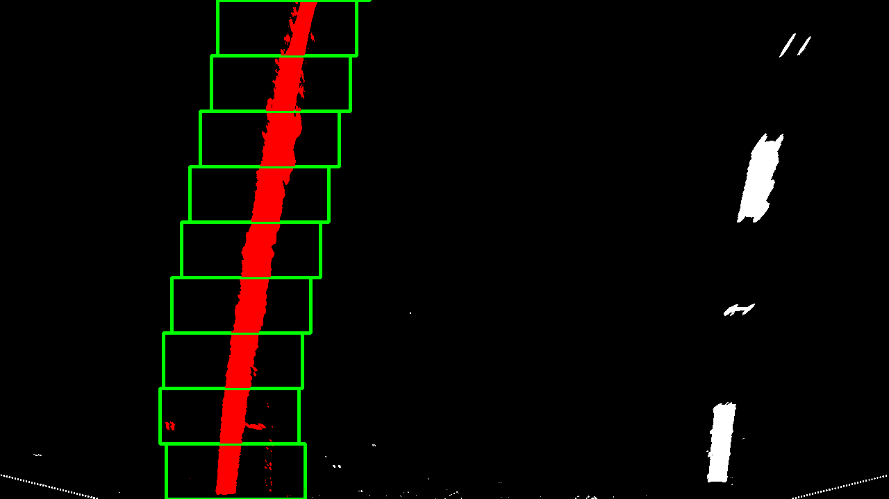
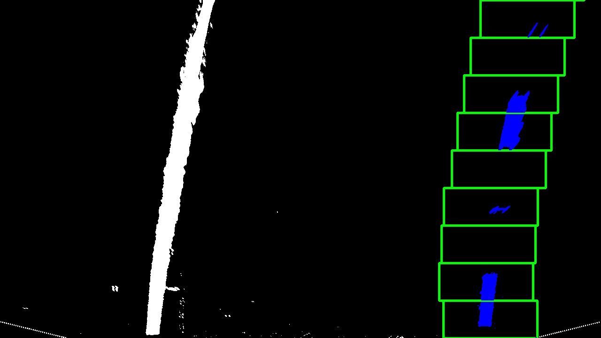
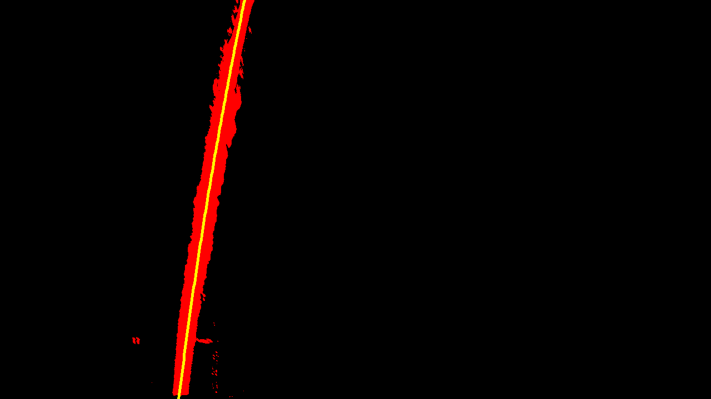
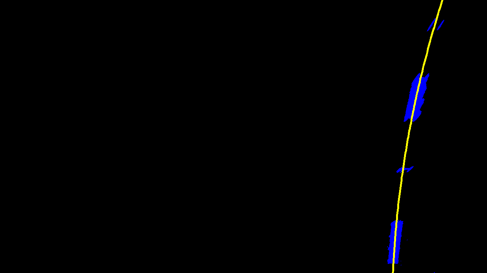

## Advanced Lane Finding
[](http://www.udacity.com/drive)

Overview
---

### Abstract

The purpose of the project is to detect and track road lanes in a traffic video. The goals / steps of this project are the following:

* Compute the camera calibration matrix and distortion coefficients given a set of chessboard images.
* Apply a distortion correction to raw images.
* Use color transforms, gradients, etc., to create a thresholded binary image.
* Apply a perspective transform to rectify binary image ("birds-eye view").
* Detect lane pixels and fit to find the lane boundary.
* Determine the curvature of the lane and vehicle position with respect to center.
* Warp the detected lane boundaries back onto the original image.
* Output visual display of the lane boundaries and numerical estimation of lane curvature and vehicle position.

### Navigation
* Project pipelines are in `advanced-lane-lines.ipynb`.
* The images for camera calibration are stored in the folder called `camera_cal`.  
* The images in `test_images` are for testing the pipeline on single frames.
* All midstep test results are in folder called `output_images` 

[//]: # (Image References)

[image1]: ./output_images/undistortion.png "Undistorted"
[image2]: ./output_images/image_undistort.png "ImageUndistorted"
[image3]: ./output_images/distort_diff.png "DistortDiff"
[image4]: ./output_images/binary_example.png "Binary Example"
[image5]: ./output_images/persp_transform_original.png "Warp Original Example"
[image6]: ./output_images/persp_transform_warped.png "Warp Example"
[image7]: ./output_images/before_line_search.jpg "grayscale_line"
[image8]: ./output_images/line_search_initial_point.jpg "histogram"

[Rubric](https://review.udacity.com/#!/rubrics/571/view)
---
### Camera Calibration

The code for this step is contained in **camera calibration** and **image undistortion** part of the IPython notebook located in "advanced-lane-lines.ipynb".  

I start by preparing "object points", which will be the (x, y, z) coordinates of the chessboard corners in the world. Here I am assuming the chessboard is fixed on the (x, y) plane at z=0, such that the object points are the same for each calibration image.  Thus, `obj_pts_i` is just a replicated array of coordinates, and `obj_pts` will be appended with a copy of it every time I successfully detect all chessboard corners in a test image.  `img_pts` will be appended with the (x, y) pixel position of each of the corners in the image plane with each successful chessboard detection.  

I then used the output `obj_pts` and `img_pts` to compute the camera calibration and distortion coefficients using the `cv2.calibrateCamera()` function.  I applied this distortion correction to the test image using the `cv2.undistort()` function and obtained this result: 

![alt text][image1]

### Pipeline (single images)

#### 1. Provide an example of a distortion-corrected image.

We apply the distortion correction to a test image, for example `test6.jpg`, again using the cv2.undistort function. This is in **image undistortion** part. The difference between original and undistorted image
is displayed as well. The result is shown below.

![alt text][image2]

![alt text][image3]

#### 2. Describe how (and identify where in your code) you used color transforms, gradients or other methods to create a thresholded binary image.  Provide an example of a binary image result.

A combined binary mask has been created in order to keep the pixels belonging to the lane lines, removing as much noise/irrelevant pixels as possible from the rest of the image. We have used masks based on color and gradients, which are described in the following subsections.

##### color masks

First, we create masks based on color. We know that the lane markings will
usually be either white or yellow, so we create masks for those two colors.

The first step is to convert the image to the `HLS` color space as follows:

```python
img_hls = cv2.cvtColor(img, cv2.COLOR_RGB2HLS)
```

The motivation is that the pure color information is more robustly contained in the `H` (hue)
channel. Another option would have been to choose `HSV` color space. However
we observed that it was trickier to properly isolate the white color.

The color masks are implemented in **color masks** part. In particular, the yellow and
white masks are obtained using the `cv2.inRange` function:

```python
def get_yellow_mask(img_hls):
    yellow_lower = np.array([15,50,100])
    yellow_upper = np.array([25,200,255])
    return cv2.inRange(img_hls, yellow_lower, yellow_upper) // 255
    
def get_white_mask(img_hls):
    white_lower = np.array([0,  200, 0])
    white_upper = np.array([255,255, 255])
    return cv2.inRange(img_hls, white_lower, white_upper) // 255
```

##### gradient masks

To make it more robust, we also compute a mask based on gradients. In particular,
we use the **Sobel operator** seen in the lectures, using the OpenCv function
`cv2.Sobel`. We have experimented with gradients
in X and Y directions independently, gradient magnitude and direction.
The implementation appears in **Gradient Masks** part. The conclusions are:

 - Sobel in X direction is extremelly useful since the lane lines are vertical.
 Sobel Y can detect most of them as well, but returns extra undesireable gradients
for example when having shadows across the road.

 - Gradient magnitude combines sobel X and Y, therefore keeping the problems of
 Sobel Y.

 - Gradient direction is extremelly noisy and doesn't allow us to better
 extract the lane lines.

Therefore the chosen solution is to **only use the Sobel X mask**.

##### final mask

Finally, we combine the previous masks to get the best of both worlds using
a **bitwise OR operation** (addition) of the yellow, white and gradient masks.
This is implemented in **Combined Mask** part, using the function `cv2.bitwise_or`.

The result is shown in `binary_example.png`:

![alt text][image4]

As been observed, the lanemarkings are clearly detected all the way
forward to the horizon, and the shadows have been robustly filtered out. This
will make the process of lane fitting much easier.

#### 3. Describe how (and identify where in your code) you performed a perspective transform and provide an example of a transformed image.

One of the goals of the project is to compute the road curvature and
vehicle position within the lane. In order to do that, we must obtain
a **birds-eye view** of the image, which allows us to obtain real measurements,
not affected by the perspective of the camera.

This operation is called **perspective transformation**, and it is implemented
in **Perspective Transform** part. We use the OpenCV functions
`cv2.getPerspectiveTransform` and `cv2.warpPerspective` to this extent.

First, we need to manually select 4 points in the source image. These points must
lie on the same plane. We take the image `test_images/straight_lines1.jpg`
for this purpose, since the road is straight.

The chosen points can be seen in the red polygon shown in
`persp_transform_original.png`:

![alt text][image5]

These 4 points are mapped into a rectangle,
with parallel lines, as shown in `persp_transform_warped.png`:

![alt text][image6]

As can be seen, the road lines don't appear parallel in the original image
due to the camera perspective, but after the perspective transform they do
appear parallel, since we chose the 4 points carefully to do so. 

The point correspondences are chosen as follows:

```python
x1 = 195
x2 = 1090
y_horizon = 465
src_pts_ = ((x1, img.shape[0]),
            (x2, img.shape[0]),
            (705, y_horizon),
            (575, y_horizon))

off = 100 # Horizontal offset to have more space and better estimate sharp curves
dst_pts_ = ((x1 + off, img.shape[0]),
            (x2 - off, img.shape[0]),
            (x2 - off, 0),
            (x1 + off, 0))  
```

which gives:

| src       |  dst      |
|:---------:|:---------:|
|195,  720  | 295, 720  |
|1090, 720  | 990, 720  |
|705, 465   | 990, 0    |
|575, 465   | 295, 0    |

**NOTE**: it is important that the `x` position for the points that lie on
the _bottom_ of the image are equally scaled/offset when transforming from
`src` to `dst`, in order to preserve the information about where in the lane
the vehicle is. Otherwise it could give a false impression that the vehicle is centered.

#### 4. Describe how (and identify where in your code) you identified lane-line pixels and fit their positions with a polynomial?

The process has been implemented in the following steps. The starting point
is the image obtained after applying the binary mask and the perspective
transform, discussed in previous sections. We will refer to this image as
`img_warped`:

1. Search for the pixels belonging to the line.
2. Fit a second-order polynomial to each set of pixels.

We explain these 2 steps in the following sections.

#### Line search

When we receive the first video frame, we have no information about the lane
lines in the image. Therefore we must perform a search without prior assumptions.
We will work with the birds-eye view image (`img_warped`), passed through the
`combined_mask()` function, as explained before.

The implemented approach is as follows:

1. Discover the starting point of the line, in the bottom of the image.
2. Follow the line all the way up to the top of the image, using a sliding
window technique.

The code that implements and verifies this part of the pipeline can be
observed from **Lane Fitting** part.

#### Starting point

To search for the starting point of the lines, we compute the **histogram**
over the number of pixels for each `x` position in the image. To simplify
the computations and make it more robust, we only perform this operation
in the **bottom half of the image**. This is implemented in **Lane Pixels Detecting**:

```python
def get_starting_x(img, visualize=False):
    # Compute histogram
    histogram = np.sum(img[int(img.shape[0]/2):,:], axis=0)
    
    if visualize:
        plt.plot(histogram);
        plt.autoscale(enable=True, axis='x', tight=True);
        plt.savefig('./output_images/line_search_initial_point.jpg')
        
    # Get left and right peaks. Assuming that left and right
    # lines will be on the left or right half of the image
    x_half = int(len(histogram)/2)
    x0_left  = np.argmax(histogram[0:x_half])
    x0_right = x_half + np.argmax(histogram[x_half:])
    
    return x0_left, x0_right
```


The image `img_warped` that we start with is shown in the figure
`before_line_search.jpg`:

![alt text][image7]

The histogram over non-zero pixels values is shown in
`line_search_initial_point.jpg`:

![alt text][image8]

The result is the starting position of each line along the `x` direction, in pixels:

```
Left line at x = 339, right line at x = 1044
```

It can clearly be seen that there are 2 main peaks, which correspond to the starting
position of the lines.

#### Sliding window search

We now know where to start searching. The next step is to place a box around
this starting point, extract the non-zero pixels inside it, and then move it
upwards following the line, all the way up to the top of the image.

The sliding window is moved as follows:

 - It moves the amount `size_y` in the vertical direction, where `size_y` is the
size of the window.
 - If the window contained pixels, it moves towards the mean `x` position of those
pixes. Otherwise it moves the same amount as in the previous step, assuming
that the line has the same curvature in the image.

This functionality is implemented in the `SlidingWindow` helper class (see `cell #17`).
In addition, a `Line` class has been created to store the pixels extracted
from the sliding window.

The function that takes `img_warped`, the starting search position `x0` and
extracts the pixels corresponding to the line is called `get_line_pixels`,
implemented in `cell #20`.

An example is shown for both the left and right images, respectively, in
`sliding_window_search_left.jpg` and `sliding_window_search_right.jpg`. The red
squares represent the different positions of the sliding windows while searching
for the line pixels.




The final result is that each line contains a list of the `x` and `y` coordinates
of the pixels that it contains.

#### Line fitting

Once we have the pixels for each line, we can perform **line fitting**, where
we simply fit a second-order polynomial to the stored `x` and `y` datapoints.
This is performed using the function `np.polyfit(y, x, 2)`, inside the function
`fit` of the `Line` class (see `cell #15`).

**NOTE**: we fit the polynomial using `y` as `x` and viceversa for a more stable
result (since the lines are almost vertical) and since it will be useful later
on for drawing purposes.

Finally, we plot the polynomial on top of the original image by just computing
the corresponding `x` value for every `y` in the image. We use the function
`cv2.line` to plot the lines, inside the function `draw_line`, implemented
in `cell #21`.

The result can be seen in pictures `line_fit_left.jpg` (left) and
`line_fit_right.jpg`(right), with the polynomial overlaid in red. The shown
pixels are the ones that have been picked by the sliding window search.




**NOTE**: we perform fitting both in pixel coordinates and in meters, to
obtain the coefficients `self.coeffs` and `self.coeffs_m`, inside the `Line`
class, respectively. For this, we need a conversion factor between pixels and meters,
which is also part of the `Line` class:

```python
self.ym_per_pix = 30/720  # meters per pixel in y dimension
self.xm_per_pix = 3.7/700 # meteres per pixel in x dimension
```

These are estimates taken from the Udacity class, assuming that the birds-eye
view image has 720 pixels in the vertical direction covering 30 meters of road,
and 700 pixels covering the lane width (around 3.7 meters).

 The first ones are useful for drawing on the image;
the second ones will be useful for computing the road curvature and vehicle position.

#### 5. Describe how (and identify where in your code) you calculated the radius of curvature of the lane and the position of the vehicle with respect to center.

I did this in lines # through # in my code in `my_other_file.py`

#### 6. Provide an example image of your result plotted back down onto the road such that the lane area is identified clearly.

I implemented this step in lines # through # in my code in `yet_another_file.py` in the function `map_lane()`.  Here is an example of my result on a test image:

![alt text][image8]

---

### Pipeline (video)

#### 1. Provide a link to your final video output.  Your pipeline should perform reasonably well on the entire project video (wobbly lines are ok but no catastrophic failures that would cause the car to drive off the road!).

Here's a [link to my video result](./project_video.mp4)

---

### Discussion

#### 1. Briefly discuss any problems / issues you faced in your implementation of this project.  Where will your pipeline likely fail?  What could you do to make it more robust?

Here I'll talk about the approach I took, what techniques I used, what worked and why, where the pipeline might fail and how I might improve it if I were going to pursue this project further.  
